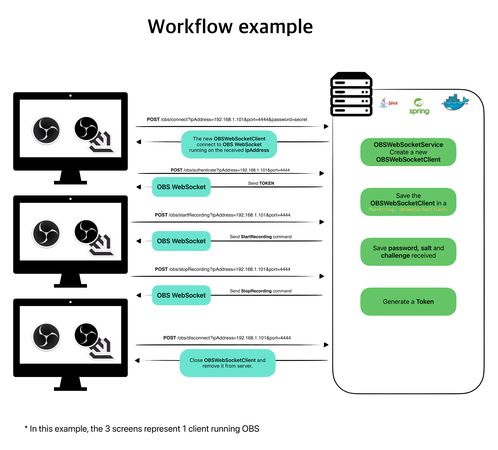
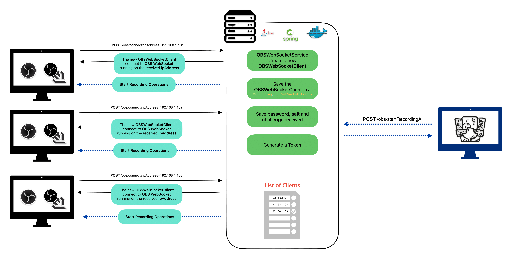

# OBS-Controller API

This is an API for controlling OBS Studio via HTTP requests.
It is written in Java with Spring Boot and uses
the [obs-websocket](https://github.com/obsproject/obs-websocket/blob/master/docs/generated/protocol.md)
plugin for [OBS studio](https://obsproject.com/).

  
  

## Installation

1. Clone this repository.
2. Run `mvn clean install` in the root directory.
3. Run `java -jar obs-controller-api-0.0.1-SNAPSHOT.jar` in the `target` directory.
4. The API is now running on port 8080.
5. You can access Documentation via Swagger UI at `http://localhost:8080/docs.html`.

## Usage

1. Start OBS Studio.
2. Enable the Websocket Server in OBS Studio.
3. Copy the ipAdresse, port and password of the Websocket Server.
4. Send `POST` requests to `http://localhost:8080/obs/connect` with the following required parameters to connect to the
   Websocket Server:
    - `ipAddress`: The ipAdresse of the Websocket Server.
    - `port`: The port of the Websocket Server.
    - `password`: The password of the Websocket Server.
5. Send a `POST` request to `http://localhost:8080/obs/authenticate` with the following required parameters to
   authenticate to the Websocket Server:
    - `ipAddress`: The ipAdresse of the Websocket Server.
    - `port`: The port of the Websocket Server.
6. Send a `POST` request to `http://localhost:8080/obs/startRecording` with the following required parameters to start
   recording:
    - `ipAddress`: The ipAdresse of the Websocket Server.
    - `port`: The port of the Websocket Server.
7. Send a `POST` request to `http://localhost:8080/obs/stopRecording` with the following required parameters to stop
   recording:
    - `ipAddress`: The ipAdresse of the Websocket Server.
    - `port`: The port of the Websocket Server.
8. Send a `POST` request to `http://localhost:8080/obs/disconnect` with the following required parameters to disconnect
   from the Websocket Server:
    - `ipAddress`: The ipAdresse of the Websocket Server.
    - `port`: The port of the Websocket Server.

## Available Endpoints

This section lists the available API endpoints for the OBS integration service. Each endpoint is a `POST` request and
requires specific parameters as part of the query string.

### OBS Connection Management

1. **Connect to OBS**
    - `POST /obs/connect`
        - Parameters: `ipAddress`, `port`, `password`
        - Example: `POST http://localhost:8080/obs/connect?ipAddress=<ipAddress>&port=<port>&password=<password>`

2. **Authenticate with OBS**
    - `POST /obs/authenticate`
        - Parameters: `ipAddress`, `port`
        - Example: `POST http://localhost:8080/obs/authenticate?ipAddress=<ipAddress>&port=<port>`

3. **Disconnect from OBS**
    - `POST /obs/disconnect`
        - Parameters: `ipAddress`, `port`
        - Example: `POST http://localhost:8080/obs/disconnect?ipAddress=<ipAddress>&port=<port>`

4. **Reconnect to OBS**
    - `POST /obs/reconnect`
        - Parameters: `ipAddress`, `port`
        - Example: `POST http://localhost:8080/obs/reconnect?ipAddress=<ipAddress>&port=<port>`

### OBS Recording Control

1. **Start Recording**
    - `POST /obs/startRecording`
        - Parameters: `ipAddress`, `port`
        - Example: `POST http://localhost:8080/obs/startRecording?ipAddress=<ipAddress>&port=<port>`
2. **Start Recording to All clients**
    - `POST /obs/startRecordingToAllClients
        - Example: `POST http://localhost:8080/obs/startRecordingAll`
3. **Stop Recording**
    - `POST /obs/stopRecording`
        - Parameters: `ipAddress`, `port`
        - Example: `POST http://localhost:8080/obs/stopRecording?ipAddress=<ipAddress>&port=<port>`
4. **Stop Recording to All clients**
    - `POST /obs/stopRecordingToAllClients
        - Example: `POST http://localhost:8080/obs/stopRecordingAll`

### Health Check

1. **Connected Clients**
    - `GET /obs/ipAddresses`
        - Example: `GET http://localhost:8080/obs/ipAddresses`
2. **Number of Connected Clients**
    - `GET /obs/count`
        - Example: `GET http://localhost:8080/obs/count`
3. **Test connection to a client**
    - `GET /obs/testConnection`
        - Parameters: `ipAddress`, `port`
        - Example: `GET http://localhost:8080/obs/testConnection?ipAddress=<ipAddress>&port=<port>`

  

## License

This project is licensed under the MIT License - see the [LICENSE](LICENSE) file for details.